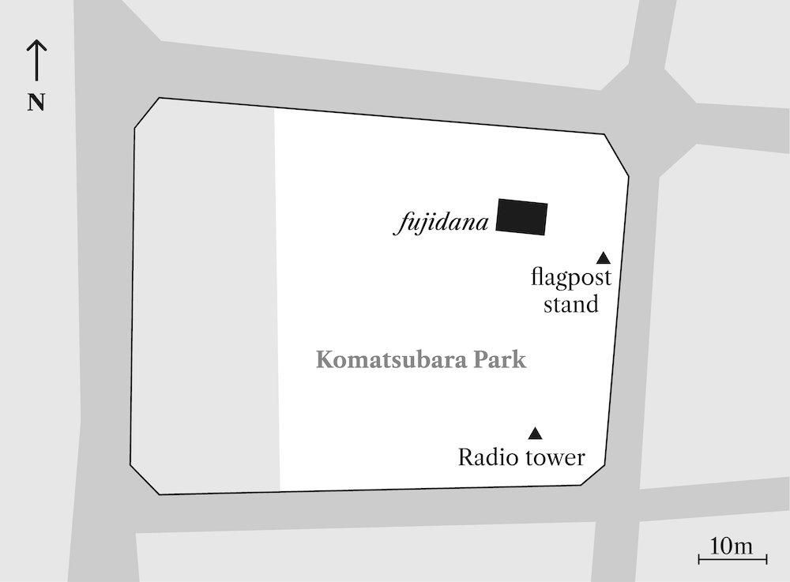

## Komatsubara Park Radio Tower {.unnumbered}

{#fig:komatsu width=60%}

The radio tower shown here is positioned in the southwest corner of a smallish public park (Komatsuba Park) in a suburban area in the northwest of Kyoto City; it is fairly typical in its design and size; primarily constructed from reinforced concrete with a roughly square cross-section, flared towards the base, and standing 2.7 m tall. It has openings in all of its faces near the top, behind which the original speakers would have been installed, and is surmounted by a gently curving gable roof. On the front face is a plaque inscribed with a four-character idiom along the lines of _mens sana in corpore sano_ (a healthy mind in a healthy body), which might seem a somewhat incongruous message to put on a public radio until one considers the contemporary connection between radio and sport and exercise (see @sec:taiso). The plaque also tells us when the tower was put in place, mentioning as it does that it was erected as part of the commemorative events connected with the 'year 2600' festivities of 1940 (see @sec:kigen26).

{#fig:plan width=60%}

As can be seen in @fig:plan, Komatsubara Park, as well as its radio tower, is also home to two other contemporary features; the _fujidana_ wisteria trellis --- designed to provide covering shade of foliage for the seating below during the summer months, and a concrete flagpole stand. These three elements seem to be more or less standard accessories for these small urban parks laid out in the interwar years. Indeed some radio towers were designed to perform a dual function as housing for a radio receiver and as a support for a flagpole. The radio tower shown in @fig:murasaki has a long semicircular indentation running up the length of its rear face, it seems likely that it was used as a flagpole support. These remaining radio towers are a physical embodiment of the link between mass, public radio listening and the nation, in this case manifested in the national flag.
