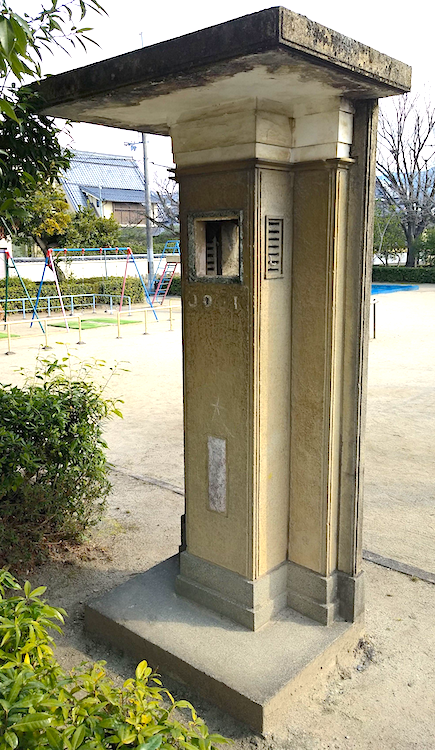
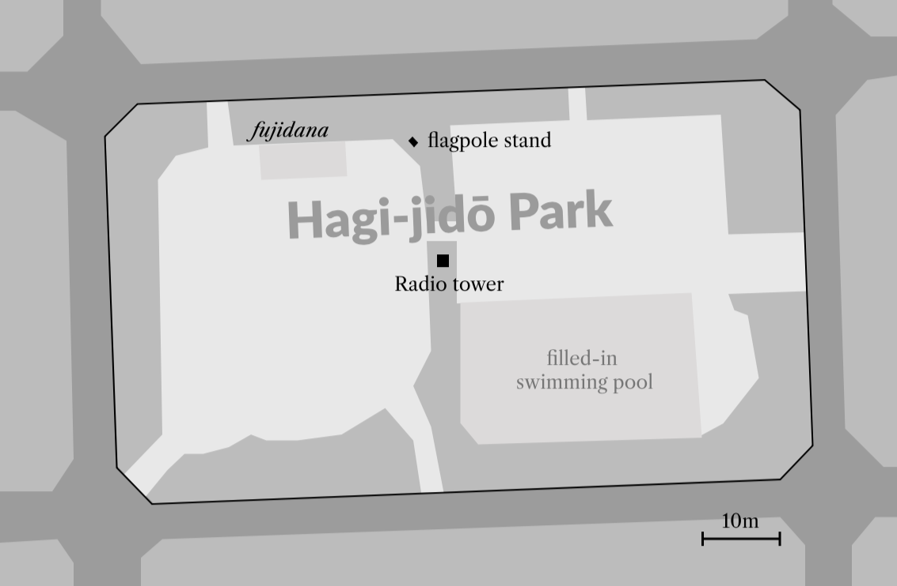

## Hagi-jidō Park Radio Tower {.unnumbered}

Stylistically, this tower, again put up in 1941, seems to fall into the 'other' category; while sharing a similar geometric-linear design it is somewhat unusual in that it has a definite front and back which is not related to its position in the park, that is it 'points' in one particular direction despite being located more or less in the centre of the park. On the front face one can still read the letters JOOK, the station sign of the Kyoto NHK station. A plaque below this is now illegible but there is another on its rear face which can still be read, it gives details of some of the individuals who contributed to its construction and gives the date of its dedication as '*kigen* 2601' (1941).

{#fig:hagijido width=70%}

{#fig:hagi-plan}
