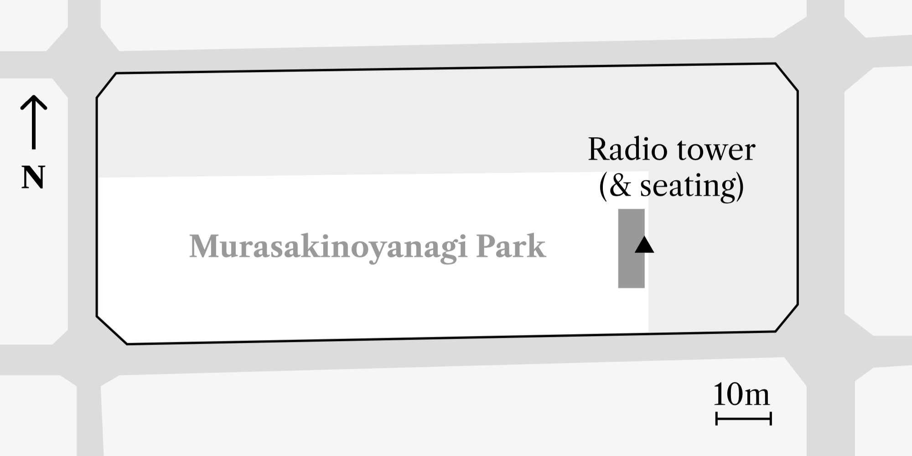

## Murasakinoyanagi Park Radio Tower {.unnumbered}

{#fig:murasaki width=60%}

'Radio towers' are perhaps a footnote (occasionally literally so, see @Kasza:1988, p252 n3) in the early history of the mass media in Japan but an interesting and informative one nonetheless.

{#fig:murasaki-plan width=70%}

Erected in 1941, this tower (@fig:murasaki) is an example of the 'modern' style and is part of a more integrated setting; situated at the western end of a long narrow park in the north of Kyoto it is the centrepiece of a seating area made up of a raised concrete platform with integrated benches along three sides. These are all decorated with the parallel linear grooved patterns common in Japanese 'art deco' buildings of this period. The rear face of the radio tower has a semicircular groove running from its peak to its base, this is probably a mount for a flagpole.
