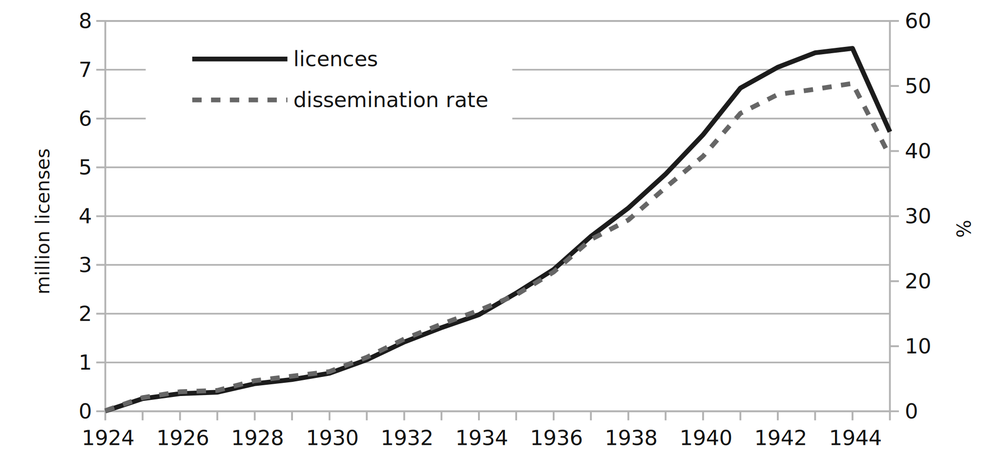

## NHK ###

Radio in this period means the broadcasts of the _Nihon Hōsō Kyōkai_ (NHK, the Japan Broadcasting Corporation); the stations that were to be merged into a single national company in 1926 started broadcasting in 1925 in the major urban centres, Tokyo, Osaka and Nagoya. By 1928 enough stations had been established to consider NHK a genuinely national network. Unlike the press and magazine industries, which had developed privately, a strong and obvious link between the state and NHK was taken as common sense, radio programming was thus to develop a consistency of outlook that was not evident in the press, as 'the political content of radio, still in its infancy as an opinion-forming medium, was almost completely in the hands of the government' [@high03, 20]. Writing on the importance of radio for the state in a 1939 article, Miyamoto Yoshio, a senior bureaucrat in the Ministry of Communications, makes the relationship clear describing NHK as acting as a 'representative organ' (_daikō kikan_) of the state [@miyamo39 12].

First its few years, for a variety of reasons but in particular the weak state of the economy across Japan, audience growth was slow and unsure. As can be seen from @fig:licences25, the period 1926--7 was particularly hard with hardly any increase in listenership.

{#fig:licences25}

{#fig:licences}

The events in China from 1931 meant that for many people --- especially those with family members fighting overseas --- the speed of access to information that radio listening provided made a license and set essentials; while it had taken NHK over six years (83 months) to attract its first million license holders, the second million was reached in under half that time (38 months) and by the start of the 1940s it was adding a million new licences in under a year and a half.

NHK reached its first major audience milestone of one million licences in the middle of February 1932, somewhat earlier than than expected @nhknenkan33[70]. This was against the backdrop of the the Manchurian(Mukden) Incident, as the manufactured pretext for the Japanese invasion of Manchuria, was coming to a conclusion, and the 1 March establishment of the Manchukuo puppet-regime. The _1933 Radio Yearbook_ announced a number of events to mark this momentous occasion, seemed to indicate that NHK felt itself now on a sound footing with the worries about its earlier difficulties in attracting listeners in the past;  just as the Russo-Japanese war of 1904--5 had driven cinema audiences[@high03, 3--5] the excitement around Japanese army successes in China drove radio listenership [@robins98, 365]. Of the five undertakings listed, third was the construction of 50 radio towers in major cities to promote radio listening and awareness of NHK [@nhknenkan33, 71].

The first public radio tower was erected at Tennōji in Osaka in August 1930 --- perhaps with the specific intention of making available live commentary from the Kōshien high-school baseball championship. JOBK, the NHK Osaka station, took the lead in establishing radio towers and 1931 saw two more established in Nara, in Sarusawa-no-ike Park, and at Minatogawa Park in Kobe [@nhknenkan38 240]. Tokyo's first tower was set up in Sumida Park in September 1932; events to mark its opening included special, and rare, public performances by Yoshiwara *geisha* and musicians. The Sumida Park tower seems to have been of unusual magnificence, 5m in height and described as 'a beautiful structure in the western style, designed by city officers to match the park surroundings' ['Sumida-kōen de rajio-tō', @asahi32-09-20, 11].
<!-- ∆RXIKJC -->

Radio listening was continually affected by the progress of the national military project; events at the Marco Polo Bridge in July 1937 were followed by a few months of increased applications for licenses, and a drop as the results of the 'incident' percolated through to the real economy and parts for radio receivers, especially vacuum tubes, became scarcer [@akiyam18, 141].

By the start of the Pacific War at the end of 1941 subscriber numbers were around 6.5 million[@nhknenkan43 8]. Total population of the home islands of Japan was just under 72 million, total number of households was in the region of 14 million[^census]. Thus, while perhaps in terms of radios per 100 people, Japan lagged behind other countries, in terms of its penetration into households, it over 40 per cent. The average household in this period consisted of roughly five people so we can see that radio broadcasts _in the home_, were reaching potentially 30 million people. As previously, interest in the overseas exploits of Japan's Navy and Army seem to have driven subscriptions to radio; between June and November of 1940 new subscriptions averaged 90--100 thousand per month. In December 1940, the month of the attack on Pearl Harbour, this number shot up to 173 thousand while the following month saw NHK gain a further 157 thousand subscribers @nhknenkan43[9].

[^census]: Source: [1940 National Census ](https://www.e-stat.go.jp/stat-search/files?page=1&toukei=00200521&tstat=000001036871)

These figures however do not necessarily reflect the reach of radio broadcasts accurately; some of the earliest adopters of radio were the new department stores, shops, cafes and restaurants for whom the radio was a tool to draw in customers. In addition to these places where a degree of commercial exchange was expected (buy a coffee, listen to the cafe's radio for half an hour) there were other 'public' places --- such as railways stations and schools[^n] --- where radio was made available, thus also putting broadcasts within the reach of those who could not purchase a receiver, and those who were unable partake in the commercially available opportunities (eg. children and the poor).

[^n]: In 1937 over half of Japan's primary 25,771 schools had a radio; the highest proportion was in the Tokyo region where 65 percent of schools had a radio, the lowest Sapporo at just under 40 percent. @nhknenkan38[218]

<!-- ## Start of Radio and NHK
Fees and licenses - @tagiku09 -->
