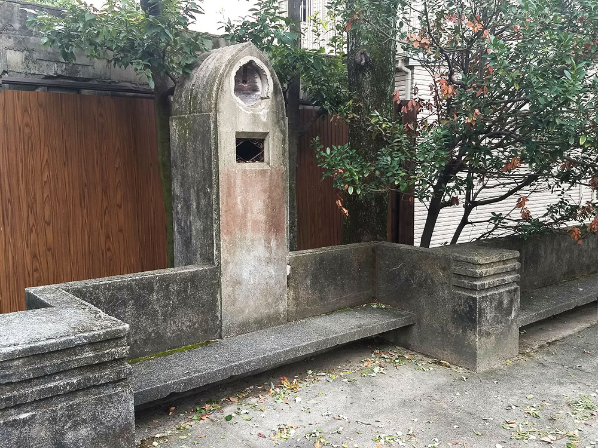

---
author-meta:
- Scott Koga-Browes
bibliography:
- content/manual-references.json
date-meta: '2020-09-14'
header-includes: '<!--

  Manubot generated metadata rendered from header-includes-template.html.

  Suggest improvements at https://github.com/manubot/manubot/blob/master/manubot/process/header-includes-template.html

  -->

  <meta name="dc.format" content="text/html" />

  <meta name="dc.title" content="Radio Towers - National" />

  <meta name="citation_title" content="Radio Towers - National" />

  <meta property="og:title" content="Radio Towers - National" />

  <meta property="twitter:title" content="Radio Towers - National" />

  <meta name="dc.date" content="2020-09-14" />

  <meta name="citation_publication_date" content="2020-09-14" />

  <meta name="dc.language" content="en-US" />

  <meta name="citation_language" content="en-US" />

  <meta name="dc.relation.ispartof" content="Manubot" />

  <meta name="dc.publisher" content="Manubot" />

  <meta name="citation_journal_title" content="Manubot" />

  <meta name="citation_technical_report_institution" content="Manubot" />

  <meta name="citation_author" content="Scott Koga-Browes" />

  <meta name="citation_author_institution" content="College of IR, Ritsumeikan University" />

  <meta name="citation_author_orcid" content="0000-0002-9963-3830" />

  <meta name="twitter:creator" content="@scokobro" />

  <link rel="canonical" href="https://scokobro.github.io/RT-manubot/" />

  <meta property="og:url" content="https://scokobro.github.io/RT-manubot/" />

  <meta property="twitter:url" content="https://scokobro.github.io/RT-manubot/" />

  <meta name="citation_fulltext_html_url" content="https://scokobro.github.io/RT-manubot/" />

  <meta name="citation_pdf_url" content="https://scokobro.github.io/RT-manubot/manuscript.pdf" />

  <link rel="alternate" type="application/pdf" href="https://scokobro.github.io/RT-manubot/manuscript.pdf" />

  <link rel="alternate" type="text/html" href="https://scokobro.github.io/RT-manubot/v/b20d678ba5bca47bc1bd3cf453bc9a9863714262/" />

  <meta name="manubot_html_url_versioned" content="https://scokobro.github.io/RT-manubot/v/b20d678ba5bca47bc1bd3cf453bc9a9863714262/" />

  <meta name="manubot_pdf_url_versioned" content="https://scokobro.github.io/RT-manubot/v/b20d678ba5bca47bc1bd3cf453bc9a9863714262/manuscript.pdf" />

  <meta property="og:type" content="article" />

  <meta property="twitter:card" content="summary_large_image" />

  <link rel="icon" type="image/png" sizes="192x192" href="https://manubot.org/favicon-192x192.png" />

  <link rel="mask-icon" href="https://manubot.org/safari-pinned-tab.svg" color="#ad1457" />

  <meta name="theme-color" content="#ad1457" />

  <!-- end Manubot generated metadata -->'
keywords:
- markdown
- publishing
- manubot
lang: en-US
manubot-clear-requests-cache: false
manubot-output-bibliography: output/references.json
manubot-output-citekeys: output/citations.tsv
manubot-requests-cache-path: ci/cache/requests-cache
title: Radio Towers - National
...


<small><em>
This manuscript
([permalink](https://scokobro.github.io/RT-manubot/v/b20d678ba5bca47bc1bd3cf453bc9a9863714262/))
was automatically generated
from [scokobro/RT-manubot@b20d678](https://github.com/scokobro/RT-manubot/tree/b20d678ba5bca47bc1bd3cf453bc9a9863714262)
on September 14, 2020.
</em></small>

## Authors


+ **Scott Koga-Browes**<br>
    {.inline_icon}
    [0000-0002-9963-3830](https://orcid.org/0000-0002-9963-3830)
    · {.inline_icon}
    [scokobro](https://github.com/scokobro)
    · {.inline_icon}
    [scokobro](https://twitter.com/scokobro)<br>
  <small>
     College of IR, Ritsumeikan University
  </small>


## Abstract {.page_break_before}


# Introduction

As the subject of this paper is probably unfamiliar, it is best to start with a straightforward description before looking back over the period in which these 'radio towers' appeared, flourished and, largely,  disappeared: The radio towers discussed here are public radio receivers mounted typically in a 2m tall concrete or wooden 'tower' in a public place, typically a park.[^defn] These towers, ultimately somewhere in the region of 400 of them, were erected around Japan between 1932 and the end of the second world war. The overwhelming majority are now lost, many destroyed in the allied bombing which destroyed much of the urban landscape, but there are roughly 40 known to be still standing. These radio towers are a now rare material reminder of the largely ephemeral practise of radio listening, importantly they are a _public_ resource available to anyone with an interest in prewar Japan's mass media, and to those involved in teaching the social history of the period.

This paper offers a brief description of the media landscape in which the radio towers appeared. documents their growth and spread and offers brief descriptions of several examples. We start by looking at some examples as it is best to establish exactly what kind of object, in what kind of setting, we are talking about here (see @fig:komatsu). The examples are all to be found in the Kyoto City area but can be considered representative of the typical types of towers found around the rest of the country.

[^defn]:  For speakers of Japanese, the term used to refer to these objects is 'rajio-tō', however, confusingly, this may also be used to refer top the large metal towers used to mount broadcasting antennas, also referred to as 'tettō' (steel towers).


## Komatsubara Park Radio Tower {.unnumbered}

{#fig:komatsu width=60%}

The radio tower shown here is positioned in the southwest corner of a smallish public park (Komatsuba Park) in a suburban area in the northwest of Kyoto City; it is fairly typical in its design and size; primarily constructed from reinforced concrete with a roughly square cross-section, flared towards the base, and standing 2.7 m tall. It has openings in all of its faces near the top, behind which the original speakers would have been installed, and is surmounted by a gently curving gable roof. On the front face is a plaque inscribed with a four-character idiom along the lines of _mens sana in corpore sano_ (a healthy mind in a healthy body), which might seem a somewhat incongruous message to put on a public radio until one considers the contemporary connection between radio and sport and exercise (see @sec:taiso). The plaque also tells us when the tower was put in place, mentioning as it does that it was erected as part of the commemorative events connected with the 'year 2600' festivities of 1940 (see @sec:kigen26).

{#fig:plan width=60%}

As can be seen in @fig:plan, Komatsubara Park, as well as its radio tower, is also home to two other contemporary features; the _fujidana_ wisteria trellis --- designed to provide covering shade of foliage for the seating below during the summer months, and a concrete flagpole stand. These three elements seem to be more or less standard accessories for these small urban parks laid out in the interwar years. Indeed some radio towers were designed to perform a dual function as housing for a radio receiver and as a support for a flagpole. The radio tower shown in @fig:murasaki has a long semicircular indentation running up the length of its rear face, it seems likely that it was used as a flagpole support. These remaining radio towers are a physical embodiment of the link between mass, public radio listening and the nation, in this case manifested in the national flag.


## Murasakinoyanagi Park Radio Tower {.unnumbered}

{#fig:murasaki width=60%}

'Radio towers' are perhaps a footnote (occasionally literally so, see @Kasza:1988, p252 n3) in the early history of the mass media in Japan but an interesting and informative one nonetheless.

{#fig:murasaki-plan width=70%}

Erected in 1941, this tower (@fig:murasaki) is an example of the 'modern' style and is part of a more integrated setting; situated at the western end of a long narrow park in the north of Kyoto it is the centrepiece of a seating area made up of a raised concrete platform with integrated benches along three sides. These are all decorated with the parallel linear grooved patterns common in Japanese 'art deco' buildings of this period. The rear face of the radio tower has a semicircular groove running from its peak to its base, this is probably a mount for a flagpole.


## Hagi-jidō Park Radio Tower {.unnumbered}

Stylistically, this tower, again put up in 1941, seems to fall into the 'other' category; while sharing a similar geometric-linear design it is somewhat unusual in that it has a definite front and back which is not related to its position in the park, that is it 'points' in one particular direction despite being located more or less in the centre of the park. On the front face one can still read the letters JOOK, the station sign of the Kyoto NHK station. A plaque below this is now illegible but there is another on its rear face which can still be read, it gives details of some of the individuals who contributed to its construction and gives the date of its dedication as '*kigen* 2601' (1941).

{#fig:hagijido width=70%}

{#fig:hagi-plan}


## Radio around the world in 1930s

The mass-media world into which radio emerged in the mid 1920s was dominated by the popular press and cinema; this was the case in Japan as it was in other developed countries. This section will offer a brief overview of this media landscape, drawing parallels and contrasts with the 'club' of powerful nations around the world that often provided models for Japan's own development.

In the UK the 1920s saw the death of much local press and the rise of cheaper nationals aimed at a general, rather than a politically partisan, mass audience [^uk]. Japan went through similar changes; regional and city newspapers --- emergence of a national press. Fall in local diversity replaced by higher --- though not particularly high --- degree of nationwide 'informational cohesion'. Both the BBC (British Broadcasting Company, later 'Corporation'), which started regular programming in 1922, and NHK (_Nihon Hōsō Kyōkai_, Japan Broadcasting Corporation), formed in 1925 and making use of ideas and structures from the BBC. The BBC, then still a private company, had become the primary source for nationwide news during the General Strike of May 1925, when newspaper production had been interrupted. Setting aside discussion of the journalistic quality of its coverage of the General Strike, the BBC demonstrated that radio could play an important national role at a time of social, and political, conflict.

[^uk]: https://www.theguardian.com/media/organgrinder/2009/aug/21/death-of-newspapers-1910

While the BBC was emphatically a _London-based_ national broadcaster, a contrasting model of region-first broadcasting was established in Germany. Radio in Germany started during 1923--4 --- as it later did in Japan --- with the establishment of local companies, in Germany's case nine of them, which were later given nationwide, and indeed international, reach by the establishment of the Deutsches Welle transmission system in 1926.

Funding for both the German and British systems relied (in part for Germany) on a license fee.  The BBC's funding model --- a 10 shilling annual licence --- had been conceived of as a way to insulate radio broadcasting from both commercial and political pressure, allowing it to achieve Director-General Reith's vision of bringing 'the best' to every household, to 'inform, educate and entertain'. This funding model was also adopted by NHK, rejecting the commercial model established by the earliest stations in the US. NHK was intimately, and 'naturally' it was thought, linked to the nation and funded through the sale of licences to owners of receiving equipment. The dominant thinking during the process of establishing on what basis NHK should be allowed to operate was that those who benefited from radio broadcasting --- primarily listeners and the manufacturers of receivers --- should pay for it. Based on an initial projection of number of probable subscribers, the cost of a monthly license was set at &yen;2 in Tokyo and Nagoya, and &yen;1.5 in Osaka. However as the number of applications for licenses far exceeded initial predictions, license fees rapidly fell, to &yen;1 in Jan 1926, then to &yen;0.75 in April 1932. By 1935 the cost of a licence had fallen to just a quarter of its original price and cost &yen;0.5.[@nhknenkan35 255].

<!-- see factsheets etc -->


# Mass Media in 1930s Japan

This section outlines the structures and relationships between the various elements of the already existing mass media of 1930s Japan, the cinema and newspapers, with the newly emerging media of broadcast radio. I hope to show how, what we would now term 'cross-promotion' helped to integrate radio listening into the everyday life of much of the populace, especially those based in the growing cities.

## Film and Radio {.unnumbered}
<!--623-->
The development of cinema-going in Japan was similar to that in many countries; projection cinema reached Japan in 1897 with the arrival of both the French Cinématographe Lumière and the American Edison Vitasacope [@Anderson:1982, 22]. At first films were exhibited in any structure that could accommodate a screen, projector and audience, often a theatre (ie. used for dramas or live musical performances) it was not until the early 1920s that the first purpose-built cinemas appeared. By the early 1930s cinema-going was a part of daily life for many in Japan's urban centres, interest sustained by the increasingly numerous film magazines, newspaper reviews and cinema columns, and publication of screening schedules for major entertainment centres such as Tokyo's Asakusa district. <!-- Source: ∆QKJMSA -->Despite the worldwide economic depression, decreases in the price of cinema tickets led to growth in audiences at Tokyo's cinemas, centred in around Asakusa. In 1929 yearly audiences at Asakusa's 35 cinemas were in the region of 1.3 million people, for the 185 cinemas in a round Tokyo, January 1930's total audience was 4.1 million people up from the previous January's 3.3 million, and audiences for subsequent months were showing year-on-year increases of 300,000 people. ('_Nenshu roku-sen-man-en de zeikin wazuka ni-man-en_', Tokyo Asahi Shimbun, 8 July 1930, p 11)

The early content of cinema programs was a mix of domestic and imported productions, with all the diversity of opinion and form that implies. As High [-@high03, 8] points out that, until events in Manchuria tilted Japan towards war in 1931, there was little that could be identified as a consistent approach or political outlook across film-makers --- films were produced which invited sympathy for pacifism, and others that celebrated 'Japan's age-old "military spirit"';

> After 1931, and the feeling that through the intervention of foreign powers Japan had been cheated of the spoils of victory it deserved - this led to a increased determination is some quarters, including film makers, to contribute to a renewed 'steeling' of the nation. @high03[8-9]

The film industry retained a degree of diversity, often coping rather by  avoiding the issues of the day [@high03, 19], until it was finally bound to the state by means of the Film Law of 1939 [@makino00].

As far as the interactions between film and radio are concerned we can identify many which were reminiscent of that in other countries and one in particular that was a product of one of the most characteristic features of early cinema in Japan; the presence of a _benshi_ (narrator) for silent films. One early experiment involved having well-known  _benshi_ narrate live on radio; this was described by one commentator as like being stuck outside the cinema unable to get in to watch the film. This frustrating program was soon abandoned.

While radio grew into an already populated landscape of mass culture, it brought something new and revolutionary, liveness:

> The emergence of radio did more than thicken the mass-media and decades: It brought it to explosive, 'critical mass.' In the 1880s, the advent of mass-circulation newspapers had created a sense of nationwide, cultural homogeneity and, more significantly, a certain sense or 'current events' immediacy. But the impression they provided of a universally  shared moment involved a certain time lag – it was 'nowadays,' or at best, 'this week,' the past several days. The new shared moment, born with the radio, was the thoroughly modern, instantaneous now. [@high03, 27]

This property was to become increasingly important as the 1930s progressed, offering the state techniques to promote and emphasise national unity, and a oneness of mind and body that bound all Japanese to the national purpose.

## Newspapers, magazines and radio {.unnumbered}

Japan's first newspapers were effectively imports, the creations of foreigners active in the treaty ports during the years after the Meiji Restoration (1868). A genuine domestic press --- Japanese news created by Japanese reporters and editors, and aimed at a Japanese readership, had to wait until there was sufficient knowledge and experience in the local community, and the inherent difficulties of producing a newspapers in the Japanese language, with its complex non-alphabetic script, had been overcome by printers. By the start of the 1920s  the domestic newspaper market had undergone a series of transformations with changes to the variety and scale of papers, their relationship with sponsors (political and financial, often the same people), and that with their audiences having led to a newspaper 'system' --- consisting of a diversity of papers ranging from cheaper, more popular, mass circulation papers to more specialised ones aimed at a particular narrower type of reader --- that might have been recognisable in many countries around the world at the time.

> By the 1920s, newspapers like the Tokyo-based *Mainichi shinbun* or *Asahi shinbun* already reached daily circulations of more than a million copies and the inaugural issue of Kodansha's popular magazine *Kingu* sold the enormous number of 750,000 copies @schafe12[15]

The growth of radio was a boon for many newspapers, in particular the Yomiuri. In August 1923 the Yomiuri newspaper moved its headquarters to newly built premises near the modern day Ginza in Tokyo, two weeks later on 1 Sep 1923 they it destroyed in the Great Kantō Earthquake. Future television and baseball entrepreneur Shōriki Matsutaro took over as president in February 1924 and, partly thanks to his innovative attitude to coverage of the newly popular phenomenon of radio, was able to rebuild the paper over the following years. The Yomiuri was the first newspaper to publish a specific radio supplement; in 1925 its readership was still fairly small, in the region of approximately 50,000, it was said to have increased its sales by 'thousands per month' in the period after its decision to start including its pink-paper 'Yomiuri Rajio-ban' supplement [@nhk01-1 36]. By 1932 all the major Tokyo newspapers were printing a radio special, or had a page or column, dedicated to radio programming, with the intention of appealing to the gradually growing radio audience, the Yomiuri's version seems to have maintained its appeal by concentrating on reproducing the lyrics of songs scheduled to appear in the day's radio broadcasts @nhknenkan32[74--5].

Newspapers played a primary role in informing their readers of the day's radio schedule, delivering printed information into the home every morning, and for many every evening too, this was something which NHK on its own was unable to do. In the longer term this had the effect --- no doubt inevitable --- of shifting the populace's information-seeking activities away from print as radio built up its news broadcasting; over the decade from 1932 children began to obtain more and more of their information about the world from the radio;

> compared to 1932, the influence of the radio had significantly increased in 1942: 37.1% of the children obtained their news on current affairs from newspapers and the radio, 36.6% merely from the radio and only 13.3% exclusively from the press. @schafe12[58]

Radio, as both a technology and as a form of entertainment and communication, as well as providing material for the already operating newspaper industry, gave birth to an extensive popular periodical literature all of its own; the _1937 NHK Radio Yearbook_, as well as the 47 publications produced by NHK itself, lists 38 radio-related 'newspapers', including some dailies, such as the _Denki Nippō_ (Electric Times), and many other published weekly or 3 times per month. Also 35 magazines, most of which were monthlies retailing for 0.1 -- 0.8 yen per issue @nhknenkan37[313--7]. By 1941 the number of newspapers listed had declined to 31 but the magazine listing had nearly doubled to 60 @nhknenkan42[589--92], again the majority of these were monthlies. Many of these magazines were aimed at hobbyists and those interested in the rapidly developing cutting-edge technology of radio; titles often reference scientific terminology, _Ohm_ was a 0.5 yen monthly published in Kanda, Tokyo, alongside it was its slightly cheaper sister publication *Watt* (ibid. p590).

SUMMARY PAR - TODO


## NHK ###

Radio in this period means the broadcasts of the _Nihon Hōsō Kyōkai_ (NHK, the Japan Broadcasting Corporation); the stations that were to be merged into a single national company in 1926 started broadcasting in 1925 in the major urban centres, Tokyo, Osaka and Nagoya. By 1928 enough stations had been established to consider NHK a genuinely national network. Unlike the press and magazine industries, which had developed privately, a strong and obvious link between the state and NHK was taken as common sense, radio programming was thus to develop a consistency of outlook that was not evident in the press, as 'the political content of radio, still in its infancy as an opinion-forming medium, was almost completely in the hands of the government' [@high03, 20]. Writing on the importance of radio for the state in a 1939 article, Miyamoto Yoshio, a senior bureaucrat in the Ministry of Communications, makes the relationship clear describing NHK as acting as a 'representative organ' (_daikō kikan_) of the state [@miyamo39 12].

First its few years, for a variety of reasons but in particular the weak state of the economy across Japan, audience growth was slow and unsure. As can be seen from @fig:licences25, the period 1926--7 was particularly hard with hardly any increase in listenership.

{#fig:licences25}

{#fig:licences}

The events in China from 1931 meant that for many people --- especially those with family members fighting overseas --- the speed of access to information that radio listening provided made a license and set essentials; while it had taken NHK over six years (83 months) to attract its first million license holders, the second million was reached in under half that time (38 months) and by the start of the 1940s it was adding a million new licences in under a year and a half.

NHK reached its first major audience milestone of one million licences in the middle of February 1932, somewhat earlier than than expected @nhknenkan33[70]. This was against the backdrop of the the Manchurian(Mukden) Incident, as the manufactured pretext for the Japanese invasion of Manchuria, was coming to a conclusion, and the 1 March establishment of the Manchukuo puppet-regime. The _1933 Radio Yearbook_ announced a number of events to mark this momentous occasion, seemed to indicate that NHK felt itself now on a sound footing with the worries about its earlier difficulties in attracting listeners in the past;  just as the Russo-Japanese war of 1904--5 had driven cinema audiences[@high03, 3--5] the excitement around Japanese army successes in China drove radio listenership [@robins98, 365]. Of the five undertakings listed, third was the construction of 50 radio towers in major cities to promote radio listening and awareness of NHK [@nhknenkan33, 71].

The first public radio tower was erected at Tennōji in Osaka in August 1930 --- perhaps with the specific intention of making available live commentary from the Kōshien high-school baseball championship. JOBK, the NHK Osaka station, took the lead in establishing radio towers and 1931 saw two more established in Nara, in Sarusawa-no-ike Park, and at Minatogawa Park in Kobe [@nhknenkan38 240]. Tokyo's first tower was set up in Sumida Park in September 1932; events to mark its opening included special, and rare, public performances by Yoshiwara *geisha* and musicians. The Sumida Park tower seems to have been of unusual magnificence, 5m in height and described as 'a beautiful structure in the western style, designed by city officers to match the park surroundings' ['Sumida-kōen de rajio-tō', @asahi32-09-20, 11].
<!-- ∆RXIKJC -->

Radio listening was continually affected by the progress of the national military project; events at the Marco Polo Bridge in July 1937 were followed by a few months of increased applications for licenses, and a drop as the results of the 'incident' percolated through to the real economy and parts for radio receivers, especially vacuum tubes, became scarcer [@akiyam18, 141].

By the start of the Pacific War at the end of 1941 subscriber numbers were around 6.5 million[@nhknenkan43 8]. Total population of the home islands of Japan was just under 72 million, total number of households was in the region of 14 million[^census]. Thus, while perhaps in terms of radios per 100 people, Japan lagged behind other countries, in terms of its penetration into households, it over 40 per cent. The average household in this period consisted of roughly five people so we can see that radio broadcasts _in the home_, were reaching potentially 30 million people. As previously, interest in the overseas exploits of Japan's Navy and Army seem to have driven subscriptions to radio; between June and November of 1940 new subscriptions averaged 90--100 thousand per month. In December 1940, the month of the attack on Pearl Harbour, this number shot up to 173 thousand while the following month saw NHK gain a further 157 thousand subscribers @nhknenkan43[9].

[^census]: Source: [1940 National Census ](https://www.e-stat.go.jp/stat-search/files?page=1&toukei=00200521&tstat=000001036871)

These figures however do not necessarily reflect the reach of radio broadcasts accurately; some of the earliest adopters of radio were the new department stores, shops, cafes and restaurants for whom the radio was a tool to draw in customers. In addition to these places where a degree of commercial exchange was expected (buy a coffee, listen to the cafe's radio for half an hour) there were other 'public' places --- such as railways stations and schools[^n] --- where radio was made available, thus also putting broadcasts within the reach of those who could not purchase a receiver, and those who were unable partake in the commercially available opportunities (eg. children and the poor).

[^n]: In 1937 over half of Japan's primary 25,771 schools had a radio; the highest proportion was in the Tokyo region where 65 percent of schools had a radio, the lowest Sapporo at just under 40 percent. @nhknenkan38[218]

<!-- ## Start of Radio and NHK
Fees and licenses - @tagiku09 -->


# Radio and the Nation

<!-- Role of NHK outside producing and broadcasting programming; encouraging take-up of radio listening, certifying and categorizing receivers, training technicians (pro. and am.) -->

This section looks at two important and characteristic aspects of the radio-state relationship in interwar Japan, the commemorative events arranged around the 'year 2600' celebrations in 1940 and, in the decade or so leading up to this high point of Japanese national feeling, the role of sport and sports broadcasting. As far as the focus of this paper, the radio tower, is concerned, the latter is particularly important.

<!--
```
Policy change in 1936 - Imperial Way Faction loses reputation
19 leaders executed. Tōsei-ha predominates.
Military strengthens influence over politics…
Jul 1936: Cabinet Information Committee
"It is no longer adequate to just maintain public order by the MoHA and MoComms police powers […] We must take the initiative regarding news, actively manage it, and thereby contribute to the national interest" (Jun 19 Cabinet Resolution) @ienaga:1978[99-100]
AFTER 2.26 / 36 events
```
 Ienaga, S. (1978) The Pacific War: A Critical Perspective on Japan's Role in World War II. Pantheon Books, New York. p99-100 -->

Unlike the other media mentioned here citizen's participation in consumption requires more than just the few 'sen' to enter a cinema or purchase a magazine. The acquisition of a radio receiver was a major decision as receivers were far from cheap, likewise they required regular maintenance and attention.

## Wave of popular participation

Rhetoric of the 'ichi-oku' - identified the Japanese with this term emphasising the massive scale of the population, and their lack of differentiation, merely referred to as 'the one-hundred million'. Unfortunately for this snappy phrase to make sense the population of the home islands was insufficient, being around 70 million, but luckily [after DATE?] the citizens of the newly acquired occupied territories could be included and reality could be made to coincide with rhetoric in a more convincing way.

Important to know that this idea only made sense if the populations of occupied areas and colonies were included.

### Events of 1940: Kigen 2600 { #sec:kigen26 }

The later half of the 1930s saw little increase in the number of  radio towers put in place. The rapid increase after 1938 is in part due to the perceived significance of mass participation in the events planned by the  state to mark the (largely mythical) 2600th year since the founding of the Imperial line, thus Japan itself. The year marked as 1940 in the western calendar was, in the _kigen_ calendar, which took the year of the mythical enthronement of Japan's first emperor, Jimmu, 660BCE, as its start and had been used somewhat inconsistently in certain official documents since the early Meiji period, the year 2600. Seniority is important in Japanes society and this was an opportunity to mark Japan's international status as a senior nation; whereas the western powers were merely in their 1940th year, Japan (ran the subtext) had already existed for a good six centuries longer.

It was well understood that radio was now an important tool of mass mobilisation the desire to have truly national and unified mass participation in the variety of events planned for 1940 meant that radio was bound to have a role.

What was the penetration rate in 1939? TODO

However there was also a feeling that Japan had as yet failed to capitalise and make best use of radio broadcasting and that increased efforts to promote radio were urgently necessary.

By comparison with other radio nations at the end of 1938 take-up in Japan was still relatively low; in many European countries radios were already in 10-20 per cent of homes, the US had already already passed the 20 per cent mark while to the same time the rate in Japan was still under 5 per cent @nhknenkan40[6]. It was felt that more had to be done to bring radio to as great a proportion of the populace as possible.

{#fig:penet}

A 1939 article entitled 'Broadcasting and the State' penned by Miyamoto Yoshio, a senior bureaucrat in the Ministry of Communications, elucidates contemporary thinking on the relationship of broadcasting, at that point NHK, government and the Japanese people; since its inception in 1926 broadcasting in Japan, he explains, has undertaken as its mission the improvement of Japanese culture and the 'building of national spirit', and it has undertaken this role as a 'representative agency of the state' [@miyamo39 12]. In the article he laments that Japan was perhaps late in realising the power of broadcasting and stresses the urgency of realising the goal of 'one household, one receiver' (*ikko ichi jushinki*).[^campaign] In retrospect, the scheme to set up radio towers in public places around Japan can be seen as a way to provide a temporary answer to this concern, providing public access to radio broadcasts without burdening individual households with the costs of purchasing and maintaining a receiving set.

[^campaign]: NHK's three-month campaign to encourage households to each buy a radio took place starting in December 1938 [@akiyam18,141]

{ width=50% #fig:hagi }

@Fig:hagi shows one radio tower specifically linked to the commemorative events of _kigen_ 2600; the plaque on the rear face (pictured right) lists the names of the towers's 'sewanin' (organisers) and gives the date of its construction as _kigen_ 2601, that is, 1941. This tower's design is somewhat unusual in that it has a well-defined  front and back and seems to 'point' in a certain direction. The front face still bears the worn letters JOOK, the call sign of the NHK Kyoto broadcast station, and lower down another plaque which is now unfortunately too dilapidated to be read.

By 1942 concerns around the use of radio for national purposes had reached a --- perhaps somewhat hysterical --- point where it was seen as a matter of national survival; the authors of the _1942 Radio Yearbook_ write that the fall of France in the summer of 1940 was due to its failure both to prepare its airforce and _to make sure its radio broadcasts were used for the good of the state_ @nhknenkan42[4]. Given Japan's concerns during this period about the 'ABCD encirclement' and its own national survival, it is understandable that it would be eager to learn from the perceived mistakes of countries which seemed to have failed to have survived.


## Sport and Radio {#sec:taiso}

Just as the rapid uptake of television in Japan after WW2 was associated with the consumption of live sport, baseball and wrestling in particular, widespread radio listening was also the result of enthusiasm for sport and exercise. This section discusses the relationship between radio and baseball, and the later, and still current, link between radio and the national exercise program known as 'rajio taisō' (Radio Callisthenics)

@yamagu03a discusses the early radio audience and baseball listening in Osaka

In this sense Japan was part of a worldwide movement which understood the connection between sports and the nation; the 1908 Olympics had seen athletes compete as part of national teams rather than individuals, the holding of the first Football World Cup in Uruguay, and the home team's victory were vital in raising the nation's image. Likewise Mussolini's sponsorship of sports in Italy and their dominance at the World Cup of 1934, and Germany's highly politicised hosting of the 1936 Berlin Olympic Games. In the US the media's increasing realisation that there was money in stardom and sports coupled with the emergence of baseball as a mass spectator --- and listener --- sport in the late 1920s with stars like Babe Ruth.

see @sakaue14

Re 1932 LA Olympics ---

> Despite the U.S. government’s hands-off stance, other countries injected the Olympics with political significance, perhaps none more so than Japan. Intent on making a strong showing at the ’32 Games, Japan sent the largest foreign team, at nearly 130 athletes.57 The effort was part of a drive by the Japanese government to increase the country’s international standing through victories in international sports [@keys04, 177]

> Media broadcasts of the Olympics on all traditional platforms have been framed in nationalistic terms producing the ‘communitas’ that Whannel has indicated as a powerful force in shaping their broadcast and sponsorship in the latter half of the 20th century. The first CCTV coverage of a sporting event occurred with the 1936 Berlin Olympics, where 72 hours of footage was transmitted to special television viewing booths in Germany. A short-wave radio system also transmitted accounts of the Games to 40 countries (Barney et al., 2002). @marsha10[266]

see @keys04 too - to read

Also @nhknenkan33[46--55]

Now twice per morning, 6.30 and 7am broadcasts from March 1 1933 @nhknenkan33[62], moved to 6am in April

Also @abe92[9]

> Above all baseball came into vogue. One of the oldest university baseball games, Waseda versus Keio, which still exists, started in November 1903. Waseda University sent their team to Stanford University in America in 1905. Waseda, Keio and Meiji Universities founded their biannual baseball league-match in 1914, which became, in 1925, the Base- ball League of Six Universities in Tokyo, consisting of Waseda, Keio, Meiji, Rikkyo, Hdsei and Tokyo Imperial Universities. Another annual baseball championship, the National Middle Schools' Baseball Championships, began in 1915.
> [...]
> Most sports organized their own national championships between the 1920s and 1930s. Mass communication assisted this trend. *Osaka Mainichi* newspaper sponsored the creation of Japan's Olympic Games in 1913, though it did not last long. *Asahi* newspaper also sponsored the National Middle Schools' Baseball Championships. *Nippon Hoso Kyokai* (NHK, Japan Broadcasting Corporation) started a radio broadcast of the National Middle Schools' Baseball Championships in 1927

, and ,  likewise the 1936 heavyweight boxing clash between Joe Louis and Max Schmeling was perceived by many as a clash of worldviews as well as a clash of individual sportsmen, both athletes were later used by their respective nations in wartime propaganda.

State as body; people are cells, healthy cells -> healthy body.

Radio callisthenics; this now characteristically Japanese program of national exercise was conceived as one event amongst many which marked the various ceremonies around the accession of Emperor Hirohito in the autumn of 1928. First broadcast in the spring of 1929, as part of the celebration of that year's National Foundation Day (_Kigensetsu_) on 11 February. The simple and no over strenuous exercises proved popular with radio listeners and by the time of the LA Olympics in 1932, participation in the annual summer "Radio Callisthenics Meet", according to NHK's figures was close to 26 million people, about a third of the population of Japan's home islands at the time. @nhknenkan33[56--9]

Other movements around the world: Sokol, later Nazi Germany

Training the body thus a contribution to the health of the state; could be symbolic (participation symbolising the individuals wish for the success of national policy) or potentially real (healthy adults would make better workers and soldiers)

Also mention growth in interest in nutrition - IGIN had its own regular radio spot - @hopson19[22] - and produced a popular song promoting healthy eating


## Radio Towers

Started in Kansai - baseball Kōshien tournament

Area      | 1940 | 1941 | 1942
:---------|-----:|-----:|----:
Tokyo     |   13 |   62 |   93
Osaka     |   17 |   61 |   80
Nagoya    |    4 |    4 |   31
Hiroshima |    6 |   43 |   74
Kumamoto  |    8 |   38 |   55
Sendai    |    4 |   32 |   43
Sapporo   |    8 |   29 |   36
TOTAL     |   60 |  269 |  412
: Increase in number of radio towers listed in NHK Yearbook, column headings indicate yearbook year. {#tbl:increase}

<!-- 1paxNGi33etwphkg-QMbudDNp9hOFDe-RXRu6z018WZU -->


Story of radio towers in confined largely to the decade between 1932 and 1942. The origins of the radio towers go back somewhat earlier, and the effective end of the radio tower is more or less lost in the fog of war.

Known documentation is scarce and highly fragmented.

*Kōshū-yō rajio chōshu shisetsu*, mentioned on p106 of the 1932 Radio Yearbook, following on from a section describing the uptake and previous years events in 'rajio taisō'.

In general, based on the evidence of the remaining examples, radio towers can very roughly be divided into two general types design-wise; traditional and modern. The traditional type can often be very similar to a the (kaku-bozen-gata)[^toro] *tōrō* lanterns commonly seen around temple grounds and graveyards. Radio towers often share the square ground plan and the same five-fold structure (see @fig:toro)

[^toro]: 角墓前型

{width=50% #fig:toro}

The 'modern' type is rather more diverse design-wise but often echoes the Art Deco modernistic trends of the 1930s. There are also some radio towers that do not fit neatly into either of these categories, but they are relatively few. It seems as though the traditional type has survived better than the modern, @ichima17[61] suggests this may be because of their resemblance to the *tōrō* lanterns found around temples, and perhaps the assumption that they have some kind of religious association and are thus best treated with respect or at least left alone.


# Discussion

During the 1930s radio increasingly permeated a variety of public and private spaces; penetration of radio sets into private homes increased from NN to NN in the years XXXX--XXXX. Radio shops allowed passers-by to pause or gather to listen to broadcasts,  radios in cafes and restaurants became a common background to consumption, and the number of radio towers increased meaning that radio broadcasts were also available to people gathering in parks and other public spaces to relax or exercise.

# Summary and Conclusions


## References {.page_break_before}

<!-- Explicitly insert bibliography here -->
<div id="refs"></div>
